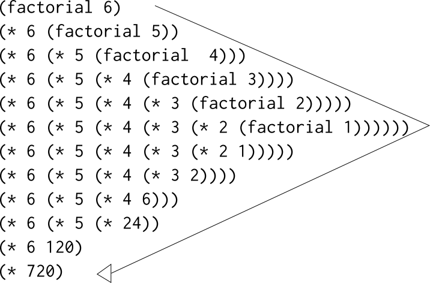

# 線形再帰と反復
階乗を求める関数を考える。  

```math
n! = n * (n - 1) * (n - 2) *** 3 * 2 * 1.
```

階乗を計算する一つの方法として、任意の正の整数*n*において、*n!*は*n*と*(n-1)!*の積に等しい、
という観察結果を利用する。

```maath
n! = n * [(n - 1) * (n - 2) *** 3 * 2 * 1] = n * (n - 1)!.
```

よって(n - 1)!を演算子、nを掛けることでn!を求めることができる。もし1!が1に等しいという
規約を付加すれば

```Scheme
(define (factorial n)
  (if (= n 1)
      1
      (* n (factorial (- n 1)))))
```

1.1.5の置換モデルを用いてこの手続きが6!の計算を実行する様子を図にした。



