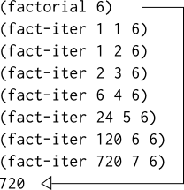

# 1.2 線形再帰と反復
階乗を求める関数を考える。  

```math
n! = n * (n - 1) * (n - 2) *** 3 * 2 * 1.
```

階乗を計算する一つの方法として、任意の正の整数*n*において、*n!*は*n*と*(n-1)!*の積に等しい、
という観察結果を利用する。

```maath
n! = n * [(n - 1) * (n - 2) *** 3 * 2 * 1] = n * (n - 1)!.
```

よって(n - 1)!を演算子、nを掛けることでn!を求めることができる。もし1!が1に等しいという
規約を付加すれば

```Scheme
(define (factorial n)
  (if (= n 1)
      1
      (* n (factorial (- n 1)))))
```

1.1.5の置換モデルを用いてこの手続きが6!の計算を実行する様子を図にした。  


もうひとつの視点から階乗の計算を見る。
n!は最初に1と2をかけ、その結果を3荷掛け、次に4にかけ、nに辿り着くまで繰り返す。  
形式的には、積の実行と、１からnまでカウントするカウンタとを一緒に保持する。カウンタと積は
同時にあるステップから次へとルールに従い変更されるということでこの演算を説明できる。

```math
product ← counter * product
counter ← counter + 1
```

ここでn!とはカウンタがnを越えた時点での積の値であると規定する。
すると、

```Scheme
(define (factorial n)
  (fant-iter 1 1 n))
(define (fact-iter product counter max-count)
  (if (> counter max-count)
      product
      (fact-iter (* counter product)
                 (+ counter 1)
                 max-count)))
```
				 
というように書き換えられる。  


前回同様、置換モデルを用いて6!の演算をFigure 1.4として示す。


示した２つの処理は一見同じように見えるが、両者は同じ数学の関数を同じ領域で計算し、それぞれがn!を求める
のにnに比例したステップ数を必要としている。実際に両者のプロセスが全く同じ一連の乗算を実行し、
全く同じ一連の部分的な積を得る。一方で２つのプロセスの**形**は全く異なっていることが見て取れる。

一つ目のプロセスについて考える。Figure 1.3を見ると置換モデルが展開のあと、収縮していることがみてとれる。
展開は*deferred operations*(遅延演算)の連鎖(乗算のつらなり)を構築するプロセスとして起こる。


