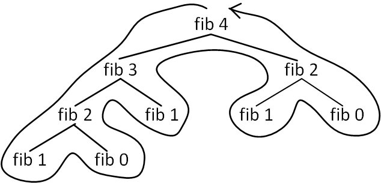

#木再帰
もう一つの演算の一般的なパターンとして**木再帰**(tree recursion)というものがあります．  
木再帰の例としてフィボナッチ数の計算をしてみましょう．  
フィボナッチ数は数列の前の項とその前の項の和が次の項になる数列です．  
```
0, 1, 1, 2, 3, 5, 8, 13, 21, ...  
```
これは，次のルールで定義が可能です．  
```
fib(0) = 0
fib(1) = 1
fib(n) = fib(n-1) + fib(n-2)
```
この定義を再帰的なLisp手続きとして翻訳してみましょう．
```scheme
(define (fib n)
  (cond ((= n 0) 0)
        ((= n 1) 1)
        (else (+ (fib (- n 1)) 
                 (fib (- n 2))))))

```
(fib 4)を計算するには(fib 3)と(fib 2)を計算します．  
(fib 3)を計算するには(fib 2)と(fib 1)を計算します．  
(fib 2)を計算するには(fib 1)と(fib 0)を計算します(それぞれ値は1と0とわかっています)．  

これを図で表すと以下のようになります．




以上のように最下層を除いて枝がそれぞれで分かれる木のように見えます．  
fib手続きが実行されるたびに自身を二回呼び出すことから来ています．

このフィボナッチ数を計算する手続きはわかりやすいですが，冗長な計算を行っています．  
一つに(fib 2)の値を二回も計算してることがあります．

手続きのステップ数は入力の値に対して指数的に増えていきますが，必要な記憶領域は線形で増加します．  
なぜ線形かというと，木の中でどのノードが上にあるのかだけ知ることができればよいからです．  
(下のノードは見る必要がありません)

ここでフィボナッチ数の計算を反復プロセスに定式化していきましょう．  
aとbという整数のペアを使って，どんどん値を変化させていきます．  
初期値としてa = 1, b = 0とすると，a + b = 1となります．  
このa + bの値をaに，元のaの値をbに更新すると，この手順によってどんどんフィボナッチ数が作れていきます．  

(fib 4)の値を計算してみます．
```
(fib 2) a = 1, b = 0より, a = 1 + 0 = 1, b = 1.
(fib 3) a = 1, b = 1より, a = 1 + 1 = 2, b = 1.
(fib 4) a = 2, b = 1より, a = 2 + 1 = 3, b = 2.
(fib 5) a = 3, b = 2より, a = 3 + 2 = 5, b = 3.
```
と，4回の計算を行うとbの値が(fib 4)になりました．  
どんどんフィボナッチ数が作れていることがわかります．  

この手続きを実装します．
```scheme
(define (fib n)
  (fib-iter 1 0 n))

(define (fib-iter a b count)
  (if (= count 0)
      b
      (fib-iter (+ a b) a (- count 1))))
```

例として「(fib 4)のために計算を4回行った結果，bの値が(fib 4)となった」ということから，  
(fib n)の値を求めるには，計算をn回行った後のbの値を知ればいいということになります．

今作成した方法は線形反復になります．  
数を大きくすると最初の例との差は非常に大きくなります．

かといって木再帰が役に立たないわけではありません．  
階層構造のデータを操作するプロセスを考えた場合には非常に強力なツールとなります．  
また，数値計算においても木再帰はプログラムの設計と理解を手助けします．  
最初のフィボナッチ数計算においても線形反復より直感的だとわかるでしょう．

##両替方法を考える

$1を50セント, 25セント, 10セント, 5セント, 1セント硬貨に両替することを考えます．  
このとき，両替方法はいくつあるでしょうか？  
また任意の金額に対して両替方法がいくつ存在するか計算する手続きを書けるでしょうか？  

この問題には再帰手続きとして簡単に書くことが出来ます．
使える硬貨をある順序で並べると仮定します．  
n種類の硬貨を用いてた金額aの両替方法の数は,  
- 最初の硬貨を使わず, 残りの硬貨で金額aを両替できる方法の数
- 最初の硬貨の金額をdとしたときの，全種類の硬貨を用いて金額a-dを両替できる方法の数

の2つを足すことで求めることが出来ます．

なぜこれが正しいのかを考えます．  
両替方法は，最初の硬貨を用いるものと用いないものの２つの方法に分類ができます.  
また，用いる方法については，最初の硬貨を用いた残りの金額に対して両替をする方法に一致します．  
よって, より少ない種類の硬貨を用いてより少ない金額の両替問題へと再帰的に小さくすることが出来ます．  

ここで両替方法の数え方について注意をします.  
aは両替金額, nは硬貨数です.
- a = 0 のとき, 両替方法は1
- a < 0 のとき, 両替方法は0
- n = 0 のとき, 両替方法は0

以上をLispに翻訳します．
```scheme
(define (count-change amount) (cc amount 5))

(define (cc amount kinds-of-coins)
  (cond ((= amount 0) 1)
        ((or (< amount 0) (= kinds-of-coins 0)) 0)
        (else (+ (cc amount (- kinds-of-coins 1))
                 (cc (- amount (first-denomination kinds-of-coins)) kinds-of-coins)))))

(define (first-denomination kinds-of-coins)
  (cond ((= kinds-of-coins 1) 1)
        ((= kinds-of-coins 2) 5)
        ((= kinds-of-coins 3) 10)
        ((= kinds-of-coins 4) 25)
        ((= kinds-of-coins 5) 50)))
```

first-denominationは利用できる硬貨の種類の数を入力に取って，最初の額を返します.  
数字は大きな数から取り出していき，だんだんとkinds-of-coinsの数を減らしています．

```scheme
(count-change 100)
292
```

count-changeではfibと同様に木再帰のプロセスを生成します.  
木再帰のプロセスはとても非効率ですが指示と理解が簡単です.  
木再帰プロセスから始めて, 効率のよいアルゴリズムに後から変更することで,  
例えば賢いコンパイラの設計を行うことができるようになります．
